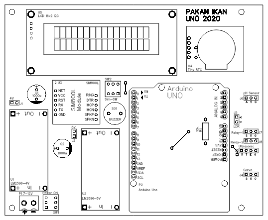
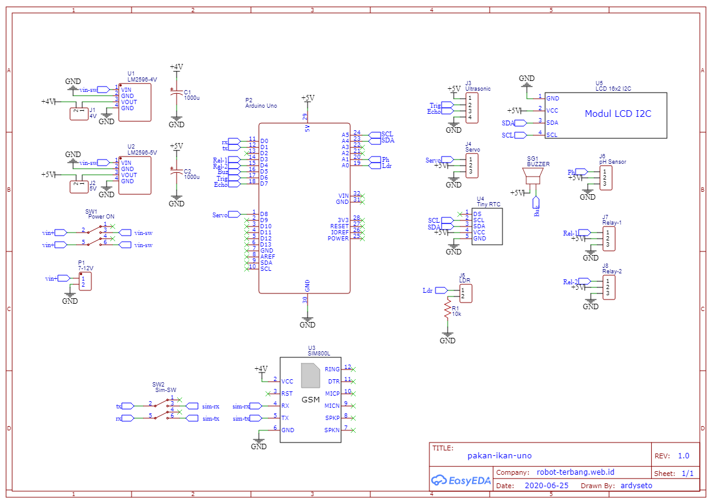
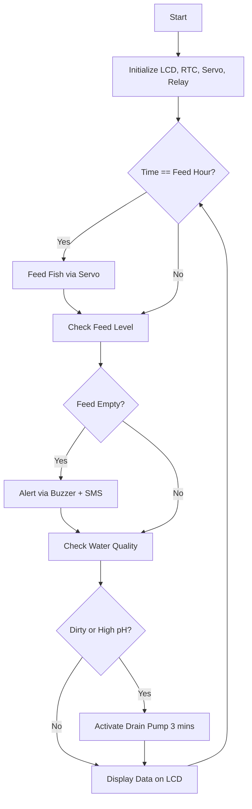

# 🐟 Smart Automatic Fish Feeder with Water Quality Monitoring




## 📦 Overview

This is a **microcontroller-based fish feeder system** developed using **Arduino Uno**, which:
- Automatically feeds fish at a specific time every day
- Detects if the **feed is running low** (using ultrasonic sensor)
- Monitors **water turbidity** and **pH levels**
- Automatically **drains dirty water** when needed
- Sends simulated SMS alerts (can be replaced with actual GSM module)
- Displays real-time info on an **I2C LCD**

---

## 🔧 Features

| Feature             | Description |
|---------------------|-------------|
| ⏰ Scheduled Feeding | Automatically feeds fish at user-defined hours |
| 📡 Ultrasonic Sensor | Measures distance to detect remaining feed |
| 💧 Water Monitoring  | Uses LDR and analog pH sensor to detect water quality |
| 🚿 Auto Drain System | Activates water pump via relay if water is dirty |
| 🔔 Buzzer Alert      | Buzzes to indicate events (feeding, low feed, dirty water) |
| 📲 SMS Simulation     | Prints SMS alerts to Serial (can be extended with SIM800L) |
| 🖥️ LCD Display        | 16x2 I2C display for pH, turbidity, and feed status |

---

## 🛠️ Hardware Requirements

| Component              | Description                      |
|------------------------|----------------------------------|
| Arduino Uno            | Main controller                  |
| RTC DS1307             | Real-time clock for scheduling   |
| Ultrasonic HC-SR04     | Feed distance detector           |
| LDR Module             | Turbidity estimation (light level) |
| Analog pH Sensor       | Water acidity sensor             |
| 2-Channel Relay Module | Controls water pumps             |
| Servo Motor (SG90)     | Opens feed container             |
| 16x2 I2C LCD           | Visual status display            |
| Buzzer Module          | Audible feedback                 |
| 5V Power Supply        | For motor and sensors            |

---

## 📁 Project Structure

```

.
├── circuit/
│   ├── skematik.png              # Schematic of the system
│   ├── 2d-pcb.PNG                # 2D PCB view
│   ├── 3d-pcb.PNG                # 3D PCB render
│   ├── top-pcb.png               # Top view PCB layout
│   ├── bot-pcb.png               # Bottom view PCB layout
│   ├── Sketch.fzz                # Fritzing sketch file
│   ├── Sketch.png                # Breadboard wiring
│   └── komponen.jpg              # Physical components used
├── code/
│   ├── libraries/                # Arduino library zips
│   │   ├── Arduino-LiquidCrystal-I2C-library-master.zip
│   │   └── RTC.zip
│   └── main.ino                  # Main Arduino program
├── LICENSE
└── README.md                     # Project documentation

```

---

## 📋 Installation Instructions

1. **Install Arduino IDE**  
   [https://www.arduino.cc/en/software](https://www.arduino.cc/en/software)

2. **Install Required Libraries**  
   In Arduino IDE, install the following via Library Manager:
   - `RTClib` (by Adafruit)
   - `LiquidCrystal_I2C`
   - `Servo`

   Or use the provided zip files under `code/libraries`.

3. **Upload the Sketch**
   - Open `code/pakan-ikan.ino` in Arduino IDE
   - Select **Board**: Arduino Uno
   - Select the correct **Port**
   - Upload the sketch

---

## ⚙️ Configuration Parameters

You can change these in `pakan-ikan.ino` file:

```cpp
String noHP = "\"+628123456789\""; // SMS target number
int feedHour = 9;                  // Feeding hour (24H format)
int pfeedDis = 30;                 // Feed level threshold (cm)
int turbidWater = 512;            // Water turbidity limit (LDR)
int pHWater = 8;                  // pH minimum threshold
```

> **Note**: `sendSMS()` is currently a placeholder. You can integrate a SIM800L module and AT commands for real SMS alerts.

---

## ✅ Functional Flow



---

## 🧪 Example LCD Output

```
pH:7 Turb:456
Dis:25cm
```

---

## 🔌 Future Improvements

* 🔄 OTA Update via WiFi or Bluetooth
* 📡 SIM800L SMS/MQTT Integration
* 📊 Logging data to SD Card or Cloud
* 🌡️ Replace DHT sensor for full environment sensing
* 🧠 Add fuzzy logic for smarter decisions

---

## 🧾 License

This project is licensed under the MIT License - see the [LICENSE](./LICENSE) file for details.

---

## ✉️ Author

**Ardy Seto Priambodo**
📫 [2black0@gmail.com](mailto:2black0@gmail.com)

---

> Love this project? Consider giving it a ⭐ on GitHub!